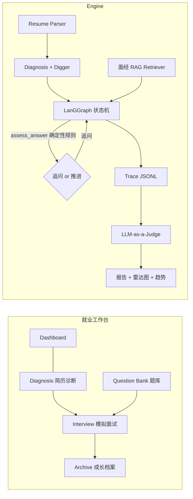

# RAI · Resume-Agent-Insight 就业工作台

> AI 驱动的求职训练场：简历体检 → 漏洞挖掘 → 动态追问模拟面试 → 可证伪评估报告 → 成长档案。

RAI 是一个帮助求职者拿到 offer 的工作台，模拟面试是其中核心的一环，而不是全部。
它先像真实面试官一样**审阅简历并挖出疑点**（漂亮的数字、模糊的职责、堆砌的名词），
再用 LangGraph 状态机驱动 **3-5 层动态追问**，结合大厂面经 RAG 检索考察技术基础，
最后由 LLM-as-a-Judge 生成带证据引用的五维评估报告——全程可回溯、可证伪。

## 功能模块

| 模块 | 说明 | 后端入口 |
| --- | --- | --- |
| 🏠 工作台 | 数据总览、快捷入口、最近面试、断点续面 | `GET /api/workbench/dashboard` |
| 🔍 简历诊断 | 五维体检打分（量化/深度/匹配/表达/完整）+ 改写建议 + 漏洞挖掘 + **JD 匹配度分析** | `POST /api/resume/upload` · `POST /api/resume/{sid}/jd-match` |
| ⚔️ 模拟面试 | intro → 项目深挖 → 技术基础 → 压力测试，**WebSocket 流式输出**，含糊回答自动追问 | `app/core/agents/graph.py`（LangGraph）· `WS /ws/interview/{sid}` |
| 📚 真题题库 | 40+ 字节/腾讯真题，按分类/公司/关键词检索，亦是面试出题源 | `GET /api/workbench/questions` |
| 📋 投递看板 | 求职投递进度管理：拖拽换列、状态时间线、投递统计 | `app/api/routes_applications.py` |
| 📈 成长档案 | 全部会话、五维分数趋势、历史报告回看、进行中会话续面 | `GET /api/workbench/sessions` |

核心设计原则（AgentX 理念）：

- **确定性规则优先**：「追问 vs 推进」由 4 条规则判定（过短/无量化/模糊词/无因果链，见 `app/core/rules.py`），触发原因随 Trace 落盘，每一次决策可证伪；
- **Mock 模式零门槛**：不配 API Key 时全流程可用确定性规则跑通（启发式解析/诊断/评分），便于演示与测试；配置 Key 后切换真实 LLM；
- **全量 Trace**：每轮对话 JSONL 落盘（`data/traces/`），报告的每个分数都能回溯到原话。

## 快速开始

```bash
# 1) 后端
python -m venv .venv
.venv/Scripts/pip install -r requirements.txt        # Windows
uvicorn app.main:app --port 8000
# 打开 http://localhost:8000 即是完整应用（前端已构建托管）

# 2) 前端开发模式（可选，热更新）
cd frontend && npm install && npm run dev            # http://localhost:5173

# 3) 端到端冒烟测试
.venv/Scripts/python.exe scripts/smoke_test.py
```

### 接入真实 LLM

复制 `.env.example` 为 `.env`，填入任一 OpenAI 兼容服务：

```ini
LLM_API_KEY=sk-xxxx
LLM_BASE_URL=https://open.bigmodel.cn/api/paas/v4   # 智谱 GLM
LLM_MODEL=glm-4-flash
# DeepSeek: LLM_BASE_URL=https://api.deepseek.com/v1  LLM_MODEL=deepseek-chat
```

## API 一览

| 方法 | 路径 | 说明 |
| --- | --- | --- |
| GET | `/api/health` | 健康检查（引擎模式、题库条数） |
| POST | `/api/resume/upload` | 上传简历：解析 + 体检诊断 + 漏洞挖掘 |
| POST | `/api/interview/{sid}/start` | 开场 |
| POST | `/api/interview/{sid}/message` | 发送回答（返回追问/推进决策） |
| GET | `/api/interview/{sid}/state` | 会话状态（含历史消息，支持断点续面） |
| POST | `/api/interview/{sid}/finish` | 提前结束并生成报告 |
| GET | `/api/report/{sid}` | 报告（Markdown + 五维分数） |
| GET | `/api/workbench/dashboard` | 工作台统计 |
| GET | `/api/workbench/sessions` | 会话档案列表 |
| GET | `/api/workbench/questions` | 题库检索（q/category/company） |
| GET | `/api/applications` | 投递记录列表 |
| POST | `/api/applications` | 新增投递（company/position/status...） |
| PUT/DELETE | `/api/applications/{id}` | 更新（含状态时间线）/ 删除 |
| POST | `/api/resume/{sid}/jd-match` | JD 对比诊断（关键词覆盖率 + 差距建议） |
| WS | `/ws/interview/{sid}` | 流式面试（token 帧 + final 帧），前端已接入 |

## 架构



## 项目结构

```
app/
├── api/            # 路由：resume / interview / report / workbench (+ WebSocket)
├── core/
│   ├── config.py   # 全局配置（.env 覆盖）
│   ├── prompts.py  # 全部 LLM Prompt
│   ├── rules.py    # 确定性规则（追问判定、兜底题库、压力场景）
│   └── agents/graph.py  # LangGraph 状态机
├── schemas/        # Pydantic 模型
├── services/
│   ├── llm.py          # LLM 客户端（真实/Mock 双模式）
│   ├── diagnosis.py    # 简历体检（启发式评分，可解释）
│   ├── mock_llm.py     # 确定性 Mock 实现
│   ├── resume_parser.py
│   ├── reporter.py     # 报告生成
│   ├── orchestrator.py # 编排层
│   └── rag/retriever.py# 面经检索（可升级 ChromaDB）
└── storage/session_store.py  # 会话 + Trace + 磁盘快照（重启可恢复）
data/
├── knowledge/      # 大厂面经知识库（43 题）
├── samples/        # 示例简历（含 PDF 生成脚本）
├── sessions/       # 会话快照
├── traces/         # 逐轮轨迹 JSONL
├── reports/        # 评估报告
└── uploads/        # 简历原件
frontend/           # React + Vite + Tailwind v4 + Lucide（五模块工作台）
scripts/            # 冒烟测试 / 示例 PDF 生成
```

## Roadmap

- [x] 简历上传 / 解析 / 体检诊断 / 漏洞挖掘
- [x] LangGraph 动态追问状态机（项目深挖 → 技术基础 → 压力测试）
- [x] 大厂面经 RAG 检索出题 + 题库浏览
- [x] LLM-as-a-Judge 评估报告 + 五维雷达 + 成长趋势
- [x] 会话持久化（重启恢复）、断点续面
- [x] WebSocket 流式面试（前端已接入，REST 自动兜底）
- [x] JD 对比诊断（关键词覆盖率 + 差距补齐建议）
- [x] 求职投递看板（拖拽换列 + 状态时间线 + 统计）
- [ ] 语音交互（TTS/STT）、多轮会话导出
- [ ] JD 匹配结果持久化与历史对比、岗位订阅聚合
- [ ] ChromaDB 向量检索替换 n-gram

## 部署

```bash
cp .env.example .env   # 按需填 Key，不填则 Mock 模式
docker compose up --build -d
# 单容器：前端构建产物由 FastAPI 托管，访问 http://localhost:8000
```
