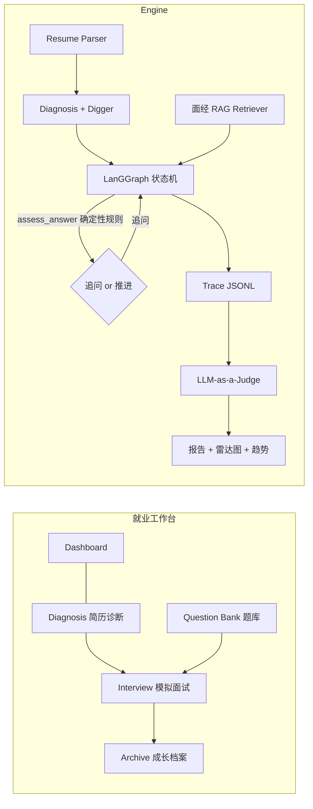

# RAI · Resume-Agent-Insight 就业工作台

[](https://github.com/minghaoxia61-web/Agent-Interviewer/actions/workflows/ci.yml)
[](https://github.com/minghaoxia61-web/Agent-Interviewer/actions/workflows/deploy-pages.yml)


> AI 驱动的求职训练场：简历体检 → 漏洞挖掘 → 动态追问模拟面试 → 可证伪评估报告 → 成长档案。

RAI 是一个帮助求职者拿到 offer 的工作台，模拟面试是其中核心的一环，而不是全部。
它先像真实面试官一样**审阅简历并挖出疑点**（漂亮的数字、模糊的职责、堆砌的名词），
再用 LangGraph 状态机驱动 **3-5 层动态追问**，结合大厂面经 RAG 检索考察技术基础，
最后由 LLM-as-a-Judge 生成带证据引用的五维评估报告——全程可回溯、可证伪。

## 功能模块

| 模块 | 说明 | 后端入口 |
| --- | --- | --- |
| 🏠 工作台 | 数据总览、快捷入口、最近面试、断点续面 | `GET /api/workbench/dashboard` |
| 🔍 简历诊断 | 五维体检打分（量化/深度/匹配/表达/完整）+ 改写建议 + 漏洞挖掘 + **JD 匹配度分析** | `POST /api/resume/upload` · `POST /api/resume/{sid}/jd-match` |
| ⚔️ 模拟面试 | intro → 项目深挖 → 技术基础 → 压力测试，**WebSocket 流式输出**，含糊回答自动追问 | `app/core/agents/graph.py`（LangGraph）· `WS /ws/interview/{sid}` |
| 📚 真题题库 | 40+ 字节/腾讯真题，按分类/公司/关键词检索，亦是面试出题源 | `GET /api/workbench/questions` |
| 📋 投递看板 | 求职投递进度管理：拖拽换列、状态时间线、投递统计 | `app/api/routes_applications.py` |
| 📈 成长档案 | 全部会话、五维分数趋势、历史报告回看、进行中会话续面 | `GET /api/workbench/sessions` |

核心设计原则（AgentX 理念）：

- **确定性规则优先**：「追问 vs 推进」由 4 条规则判定（过短/无量化/模糊词/无因果链，见 `app/core/rules.py`），触发原因随 Trace 落盘，每一次决策可证伪；
- **Mock 模式零门槛**：不配 API Key 时全流程可用确定性规则跑通（启发式解析/诊断/评分），便于演示与测试；配置 Key 后切换真实 LLM；
- **全量 Trace**：每轮对话 JSONL 落盘（`data/traces/`），报告的每个分数都能回溯到原话。

## 快速开始

```bash
# 1) 后端
python -m venv .venv
.venv/Scripts/pip install -r requirements.txt        # Windows
uvicorn app.main:app --port 8000
# 打开 http://localhost:8000 即是完整应用（前端已构建托管）

# 2) 前端开发模式（可选，热更新）
cd frontend && npm install && npm run dev            # http://localhost:5173

# 3) 测试与评测
.venv/Scripts/pip install -r requirements-dev.txt
.venv/Scripts/python.exe -m pytest tests -q          # 49 项单元/接口/回归测试
.venv/Scripts/python.exe scripts/eval_decisions.py   # 追问决策评估（黄金样本 + 轨迹模拟）
.venv/Scripts/python.exe scripts/eval_rag.py         # RAG 多引擎 recall@5 / MRR 对比
```

### 接入真实 LLM

复制 `.env.example` 为 `.env`，填入任一 OpenAI 兼容服务：

```ini
LLM_API_KEY=sk-xxxx
LLM_BASE_URL=https://open.bigmodel.cn/api/paas/v4   # 智谱 GLM
LLM_MODEL=glm-4-flash
# DeepSeek: LLM_BASE_URL=https://api.deepseek.com/v1  LLM_MODEL=deepseek-chat
```

## 质量与评估（可复现）

**测试**：`pytest tests -q` 共 49 项——追问规则黄金样本回归、API 全链路（上传→面试→报告）、
投递看板 CRUD、鉴权护栏（401/令牌）、检索引擎命中与排除逻辑。CI（`.github/workflows/ci.yml`）在每次 push 时并行跑 pytest 与前端构建。

**追问决策评估**（`scripts/eval_decisions.py`，报告落盘 `data/eval/decision_report.md`）：

- 规则回归：30 条黄金回答样本（含糊/过短/缺量化/缺因果/扎实），`assess_answer` 的决策与触发原因 **100% 符合标注**；
- 轨迹模拟：脚本化候选人跑完整状态机 19 轮，验证行为契约——含糊回答必触发追问（共 9 次 = 3 疑点 × 3 层封顶）、
  扎实回答推进、阶段按 `项目深挖 → 技术基础 → 压力测试` 按时流转。换 LLM 模型或调规则后重跑即为回归测试。

**RAG 检索评测**（`scripts/eval_rag.py`，40 条标注查询，报告落盘 `data/eval/rag_report.md`）：

| 引擎 | recall@5 | MRR | 平均耗时 |
| --- | --- | --- | --- |
| ngram（字符 n-gram Jaccard） | 1.00 | 1.00 | 1.59ms |
| bm25（纯 Python Okapi，默认） | 1.00 | 1.00 | 0.39ms |
| chroma（向量） | 待联网环境验证 | — | — |

> 两种离线引擎在标注查询集上均满分，BM25 快 4 倍，故默认 `RETRIEVER_MODE=auto` 离线时落 BM25。
> Chroma 引擎已实现（含初始化硬超时回落与 embedding 预热），配好 embedding 网络后重跑脚本即可补齐对比数据。

## 工程取舍

- **持久化：SQLite（rai.db）+ WAL。** v1 用 JSON 快照，v2 迁移到 SQLite：每轮对话原子 upsert（不再有整文件重写的撕裂风险）、
  按 owner/状态可直接 SQL 查询、单文件好备份；复杂字段（简历/消息/评分）以 JSON TEXT 列存储——它们是整体读写的数据，不需要拆列。
  旧 JSON 快照与 applications.json 在启动时自动一次性导入；Trace 保留 JSONL（追加型事件日志，与关系数据分离）。
  LangGraph SqliteSaver checkpointer 仍列在 Roadmap（多线程 resume 场景）。
- **追问判定：确定性规则 vs LLM 判断。** 追问/推进由 4 条规则决定并随 Trace 落盘——可证伪、可单测、可回归（见上），LLM 只负责话术生成。
- **Chroma 自动模式的可用性工程**：初始化带 20s 硬超时 + 进程内失败记忆（离线不再反复阻塞启动）+ embedding 预热
  （把"空集合时首次查询才崩"的晚失败提前到 init 阶段暴露）。
- **安全护栏**：`ACCESS_TOKEN` 非空时所有 API/WS 需令牌（前端自动弹框携带），每 IP 每日限额默认 300 次——公网部署时保护 LLM 费用。

## 前端设计（Persona 3 Reload 风格）

前端以《女神异闻录 3 Reload》(P3R) 的视觉语言重构：深海蓝水下动态背景（渐变 + 旋转光束 + 焦散水纹 + canvas 光斑/气泡 + 暗角）、棱角切面面板（clip-path 切角 + 青色描边光带）、顶部 HUD（MAIN 索引 + 实时时钟）、左侧竖排菜单 + 红白三角光标、底部键位条，切屏带青色光刃遮罩转场。配色通过 Tailwind v4 `@theme` 重映射默认色板实现全站统一换色。

支持游戏式键盘导航：`↑↓` 移动菜单光标、`ENTER` 确认进入、`ESC` 返回（输入框聚焦时自动让位）。

## API 一览

| 方法 | 路径 | 说明 |
| --- | --- | --- |
| GET | `/api/health` | 健康检查（引擎模式、题库条数） |
| POST | `/api/resume/upload` | 上传简历：解析 + 体检诊断 + 漏洞挖掘 |
| POST | `/api/interview/{sid}/start` | 开场 |
| POST | `/api/interview/{sid}/message` | 发送回答（返回追问/推进决策） |
| GET | `/api/interview/{sid}/state` | 会话状态（含历史消息，支持断点续面） |
| POST | `/api/interview/{sid}/finish` | 提前结束并生成报告 |
| GET | `/api/report/{sid}` | 报告（Markdown + 五维分数） |
| GET | `/api/workbench/dashboard` | 工作台统计 |
| GET | `/api/workbench/sessions` | 会话档案列表 |
| GET | `/api/workbench/questions` | 题库检索（q/category/company） |
| GET | `/api/applications` | 投递记录列表 |
| POST | `/api/applications` | 新增投递（company/position/status...） |
| PUT/DELETE | `/api/applications/{id}` | 更新（含状态时间线）/ 删除 |
| POST | `/api/resume/{sid}/jd-match` | JD 对比诊断（关键词覆盖率 + 差距建议） |
| WS | `/ws/interview/{sid}` | 流式面试（token 帧 + final 帧），前端已接入 |

## 架构



## 项目结构

```
app/
├── api/            # 路由：resume / interview / report / workbench / applications (+ WebSocket)
├── core/
│   ├── config.py   # 全局配置（.env 覆盖）
│   ├── prompts.py  # 全部 LLM Prompt
│   ├── rules.py    # 确定性规则（追问判定、兜底题库、压力场景）
│   ├── security.py # 访问令牌 + 每日限额护栏
│   └── agents/graph.py  # LangGraph 状态机
├── schemas/        # Pydantic 模型
├── services/
│   ├── llm.py          # LLM 客户端（真实/Mock 双模式 + JSON 解析重试）
│   ├── diagnosis.py    # 简历体检（启发式评分，可解释）
│   ├── jd_matcher.py   # JD 对比诊断
│   ├── mock_llm.py     # 确定性 Mock 实现
│   ├── resume_parser.py
│   ├── reporter.py     # 报告生成
│   ├── orchestrator.py # 编排层（会话锁串行化）
│   └── rag/retriever.py# 检索工厂：ngram / bm25 / chroma（auto 自动回落）
└── storage/
    ├── db.py                # SQLite 基础层（WAL + RLock + schema）
    ├── session_store.py     # 会话 + Trace + SQLite 持久化（重启可恢复）
    └── application_store.py # 投递看板存储（SQLite）
data/
├── knowledge/      # 大厂面经知识库（43 题）
├── eval/           # 黄金样本、检索标注查询、评测报告
├── samples/        # 示例简历（含 PDF 生成脚本）
├── rai.db          # SQLite 主库（会话/投递记录）
├── sessions/ traces/ reports/ uploads/ chroma/
frontend/           # React + Vite + Tailwind v4 + Lucide · P3R 风格工作台
tests/              # pytest：规则回归 / API 全链路 / 检索 / 诊断 / 鉴权 / 访客隔离
scripts/            # 评测脚本 / 冒烟测试 / 示例 PDF / headless 截图(shot.ps1)
.github/workflows/  # ci.yml（pytest+Docker构建+前端）· deploy-pages.yml（前端发布）
```

## Roadmap

- [x] 简历上传 / 解析 / 体检诊断 / 漏洞挖掘
- [x] LangGraph 动态追问状态机（项目深挖 → 技术基础 → 压力测试）
- [x] 大厂面经 RAG 检索出题（ngram / bm25 / chroma 可切换）+ 题库浏览
- [x] LLM-as-a-Judge 评估报告 + 五维雷达 + 成长趋势
- [x] 会话持久化（SQLite，重启恢复）、断点续面
- [x] WebSocket 流式面试（前端已接入，REST 自动兜底）
- [x] JD 对比诊断（关键词覆盖率 + 差距补齐建议）
- [x] 求职投递看板（拖拽换列 + 状态时间线 + 统计）
- [x] P3R 风格前端重构 + 切屏转场 + 键盘导航(↑↓/ENTER/ESC)
- [x] pytest 测试套件（49 项）+ CI + 追问决策评估集（30 样本 100%）
- [x] RAG 检索评测（recall@5 / MRR 多引擎对比）
- [x] 访问令牌 + 每日限额护栏（前端令牌弹窗）
- [ ] 后端部署到公网（Railway/云服务器）并接通 Pages 前端
- [ ] 语音交互（TTS/STT）、多轮会话导出
- [ ] JD 匹配结果持久化与历史对比、岗位订阅聚合
- [ ] LangGraph SqliteSaver checkpointer（多线程 resume / 时间旅行调试）

## 部署（公网）

### 方式零：Cloudflare Tunnel 临时演示（5 分钟、免费、无需卡）

适合"现在就要给人看"的场景：把本机服务直接暴露成公网地址（演示时保持电脑开机）。

```bash
winget install Cloudflare.cloudflared        # 或到 GitHub Releases 下载 cloudflared.exe
cloudflared tunnel --url http://localhost:8000
# 输出形如 https://xxx-yyy.trycloudflare.com 的地址即是公网入口（每次重启会换）
```

> Mock 模式下公开访问零成本；若本地切换为真实 LLM，务必先在 .env 设置 ACCESS_TOKEN。

### 方式一：Render 免费层（推荐长期挂机，仓库已带 `render.yaml` Blueprint；需绑 Visa/MC 验证）

1. 打开 [render.com](https://render.com) → 用 GitHub 登录 → **New → Blueprint**，选择本仓库
   （会读取 `render.yaml`；也可以手动 **New → Web Service**，runtime 会自动识别 Dockerfile）；
2. 在环境变量里填写：
   - `ACCESS_TOKEN=<自定义一个随机令牌>`（**必设**，否则接口会被任意调用刷爆额度）
   - `LLM_API_KEY` / `LLM_BASE_URL` / `LLM_MODEL`（真实 LLM；留空则 Mock 模式）
3. **Create Web Service** → 等待镜像构建（首次约 5-8 分钟）→ 得到 `https://<服务名>.onrender.com`；
4. 浏览器打开该地址即是**完整应用**（后端 + 前端同源托管，连 GitHub Pages 都可以不用了）。

> 免费层行为：闲置 15 分钟自动休眠，首次访问冷启动约 30-60 秒（可配 UptimeRobot 每 10 分钟
> ping 一次 `/api/health` 保活）；WebSocket 流式面试在免费层可用。

### 方式二：Hugging Face Spaces（免费、无需信用卡、作品集展示友好）

1. [huggingface.co/new-space](https://huggingface.co/new-space) → 命名如 `rai-workbench` → **SDK 选 Docker**（Blank 模板）→ Public 创建；
2. 本地执行（把现有仓库直接推到 Space，需要一个带 Space 元数据的 README）：
   ```bash
   git remote add space https://huggingface.co/spaces/<你的用户名>/rai-workbench
   git push space main:main --force
   ```
   首次 push 前需要给仓库根 `README.md` 顶部加上 Space 元数据（或单独建一个孤儿分支维护它）：
   ```markdown
   ---
   title: RAI Workbench
   emoji: 🎯
   colorFrom: indigo
   colorTo: purple
   sdk: docker
   app_port: 8000
   pinned: false
   ---
   ```
3. 在 Space 的 **Settings → Variables and secrets** 添加 `ACCESS_TOKEN` 与 LLM 相关变量；
4. Space 构建完成后地址为 `https://<用户名>-rai-workbench.hf.space`，WebSocket 可用。
   注意：免费 Space 的磁盘是临时的（重启后 sessions/traces 清空），72 天无访问会休眠。

### 方式三：云服务器 docker compose

```bash
cp .env.example .env   # 填 Key 与 ACCESS_TOKEN
docker compose up --build -d
# 单容器：前端构建产物由 FastAPI 托管，访问 http://<服务器IP>:8000
```

### GitHub Pages（纯前端 UI 演示，可选）

仓库已带 `.github/workflows/deploy-pages.yml`：push main 即自动构建并发布静态前端。
启用一次即可（需手动在 GitHub 操作）：

1. GitHub → 仓库 **Settings → Pages → Source 选择 `GitHub Actions`**（保存后重跑一次 workflow）；
2. 站点地址为 `https://minghaoxia61-web.github.io/Agent-Interviewer/`。

> Pages 无法运行 FastAPI/WebSocket/LLM 后端，无后端时数据区为空属预期。
> 要连真实数据：把后端部署到任意托管服务（Render / Railway / 云服务器 docker compose），
> 然后在仓库 **Settings → Secrets and variables → Actions → Variables** 新建
> `VITE_API_BASE=https://<后端域名>`，再 push 一次触发重部署（前端会自动用该地址请求 REST 与 WebSocket）。
